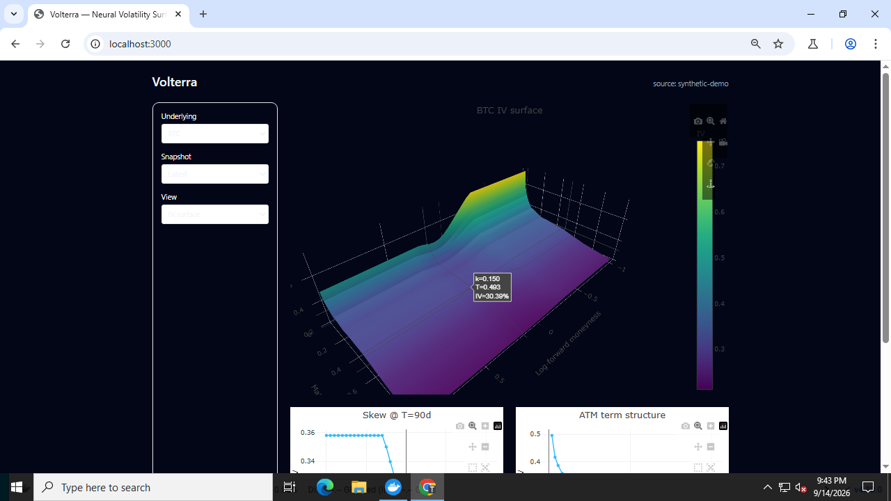
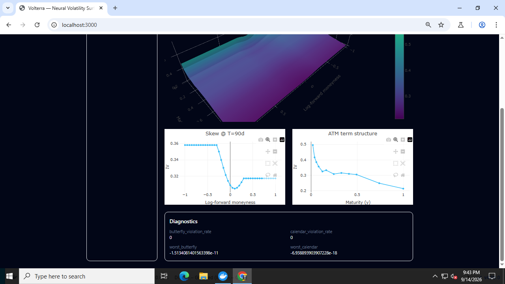

# Volterra — Neural Implied-Volatility Surface Modeler

Volterra turns noisy option quotes into a diagnosable, arbitrage-aware
volatility surface, and uses a learned pricing surrogate to accelerate
interpretable stochastic-volatility (Heston) calibration.

**Live demo:** https://volterra-web.vercel.app — renders the bundled
synthetic BTC surface even when no API is deployed.



## What it does

- Ingests an option chain (deterministic demo fixture today; Deribit
  provider scaffolded) and assembles a smooth surface on a fixed
  41×12 grid in **log-forward moneyness** / **total variance**.
- Runs arbitrage diagnostics — butterfly (call convexity in strike) and
  calendar (total variance non-decreasing in maturity) violation rates.
- Serves the surface, quotes, scenario shocks, and metrics over a FastAPI
  JSON API; renders a Plotly 3D surface plus skew and ATM term-structure
  charts in a Next.js frontend.
- Includes a PyTorch surrogate pipeline (`ml/`) that learns the map from
  Heston parameters to surfaces, then calibrates parameters by matching
  observed surfaces through the surrogate.



## Surface coordinate convention

All surface work happens in **log-forward moneyness** and **total variance**,
not raw strike and raw implied volatility:

- `k = log(K / F)` where `F = S * exp((r - q) * T)` is the forward price.
- `w(k, T) = sigma_iv(k, T)^2 * T`.

Working in `(k, w)` behaves better across maturities than fitting IV against
strike, and makes the calendar no-arbitrage condition a simple monotonicity
check. Butterfly arbitrage is checked on repriced calls on an evenly spaced
strike grid. See `src/quant/surface.py` and `src/quant/diagnostics.py`.

## Repository layout

```text
apps/web/                 # Next.js frontend (Plotly 3D surface, diagnostics UI)
services/api/             # FastAPI service (+ migrations, Dockerfile)
services/worker/          # Deribit ingestion worker (DEMO_MODE default)
src/quant/                # shared numerical code
  black_scholes.py        # BS pricing + Brent implied-vol inversion
  surface.py              # quote -> total-variance surface assembly
  diagnostics.py          # butterfly/calendar arbitrage diagnostics
ml/                       # surrogate dataset / training / evaluation
tests/                    # pytest suite + deterministic BTC demo fixture
docker-compose.yml        # postgres + redis + api
render.yaml, railway.toml # one-click API deploy manifests
.github/workflows/ci.yml  # lint + tests + frontend build
```

## Quickstart

```bash
# Python environment (3.12)
pip install -e ".[dev,api]"
pytest -q                 # ~1700 tests: IV round-trips, pathological quotes,
                          # surface assembly, diagnostics, API contracts

# API — demo mode serves the bundled synthetic BTC chain
cd services/api && uvicorn main:app --port 8000
curl http://localhost:8000/v1/health        # {"status":"ok",...}
curl http://localhost:8000/v1/surfaces/BTC  # 41x12 surface + diagnostics

# Frontend
cd apps/web && npm install
NEXT_PUBLIC_API_BASE=http://localhost:8000 npm run dev   # http://localhost:3000
# With no API configured the UI falls back to the bundled demo payload.

# Surrogate pipeline (pip install -e ".[ml]", CPU)
python ml/generate_dataset.py --n 300
python ml/train_surrogate.py --epochs 3    # writes ml/artifacts/heston_surrogate.pt

# Local state services
docker compose up postgres redis
```

The deterministic demo chain (`tests/fixtures/btc_chain_demo.json`,
regenerate via `tests/fixtures/generate_demo_fixture.py`) lets everything
run end-to-end without Deribit access.

## Deployment

See [DEPLOYING.md](DEPLOYING.md): Vercel CLI steps for `apps/web`, and
Railway (`railway.toml`) / Render (`render.yaml`) flows that build
`services/api/Dockerfile` with a `/v1/health` health check.

## Roadmap

- Real Deribit persistence (PostgreSQL) + Redis caching in the worker.
- Heston surrogate wired into `/v1/calibrations/heston` (artifact exists;
  endpoint currently returns `demo_not_calibrated`).
- Model registry / object-storage URIs for artifacts.
